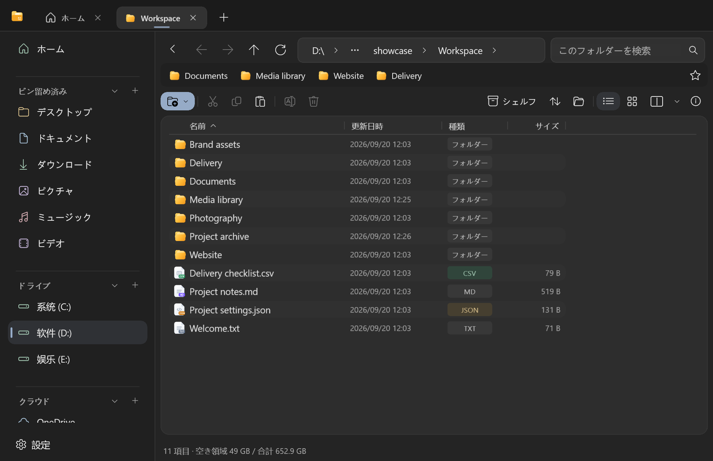
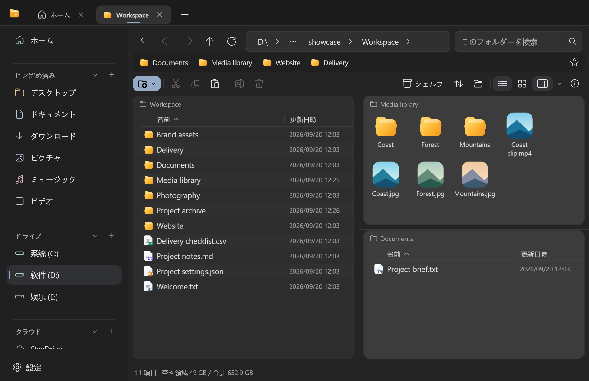
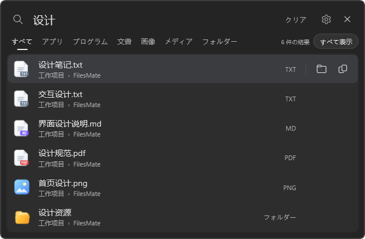

# FilesMate

[English](README.md) · [简体中文](README.zh-CN.md) · 日本語

FilesMate は、日常のファイル操作に使う Windows 向けファイルマネージャーです。タブ、2・3 ペイン表示、ファイル名検索、ドキュメントのプレビュー、お気に入りバー、フォルダーごとの表示設定に対応しています。



現在はプレビュー版です。Windows 11 22H2（ビルド 22621）以降の x64 環境が必要です。Windows 10 と ARM64 は、このインストーラーではサポートしていません。

## 表示言語

設定 → 全般 → 表示言語で、システムに合わせる・簡体字中国語・English・日本語を選べます。変更すると、ファイル転送の完了後に FilesMate と起動中のバックグラウンド検索が自動的に再起動し、タブが復元されます。ファイル名やユーザーが付けたタグは変更されません。日付や数値の書式は Windows の地域設定に従います。

## 主な機能

- 内蔵エンジンで ZIP・7z を作成し、対応する暗号化・分割アーカイブを展開できます。外部の圧縮ソフトも設定で選べます。対応範囲は[圧縮機能の説明](docs/archive-support.md)をご覧ください。
- タブと 2・3 ペインで複数の場所を開き、コピー・移動・名前の変更を行えます。選択中のレイアウトをもう一度押すと 1 ペインに戻ります。
- グローバル検索は別のプロセスで動作します。ファイルマネージャーを閉じても、検索を常駐させる設定なら Alt+Space で呼び出せます。
- 選択したファイルは Space でプレビューできます。対応形式や互換プレビューの条件は、[プレビュー版の説明](installer/Preview-Readme.ja.txt)をご覧ください。
- 外観、透明度、表示する列、ホーム画面のセクションなどを調整できます。





## ビルドとテスト

PowerShell 7、`global.json` が指定する .NET 10 SDK、およびプロジェクトが参照する WinUI ビルド依存関係を使用します。

```powershell
pwsh ./scripts/build.ps1 -Configuration Release
pwsh ./scripts/test.ps1 -Configuration Release
```

インストーラーの作成には Inno Setup 6 が必要です。

```powershell
pwsh ./scripts/package.ps1
```

作成したインストーラーには実行環境が含まれるため、利用者が .NET SDK をインストールする必要はありません。

## 開発への参加

[開発ガイド](CONTRIBUTING.md)、[翻訳ガイド](docs/localization.md)、[アーキテクチャ](docs/architecture.md)、[検証済みの範囲と残る課題](docs/public-release.md)を参照してください。不具合の報告には、再現手順、Windows のバージョン、FilesMate のバージョンを添えてください。スクリーンショットやログに個人情報が含まれていないか確認してください。

## ライセンス

[Apache License 2.0](LICENSE) で公開しています。同梱する第三者のコードと実行環境には、それぞれのライセンスが適用されます。[NOTICE](NOTICE) と [THIRD-PARTY-NOTICES.md](THIRD-PARTY-NOTICES.md)をご覧ください。
