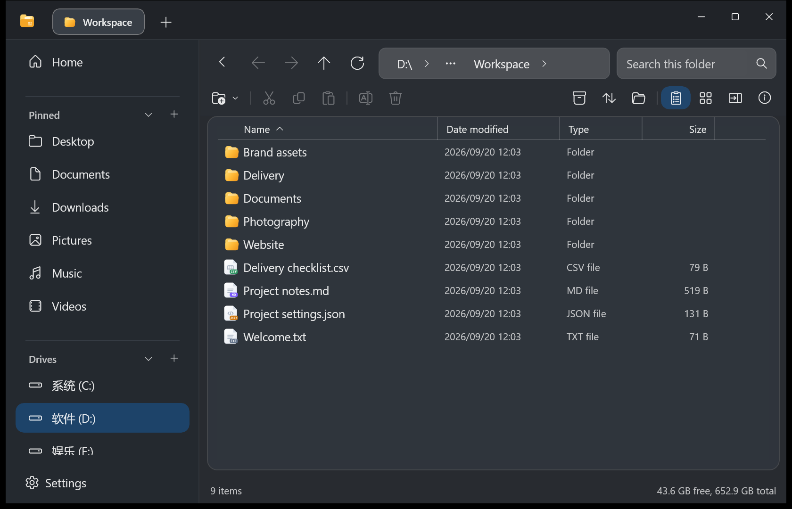
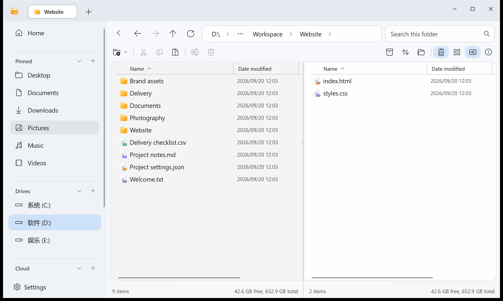
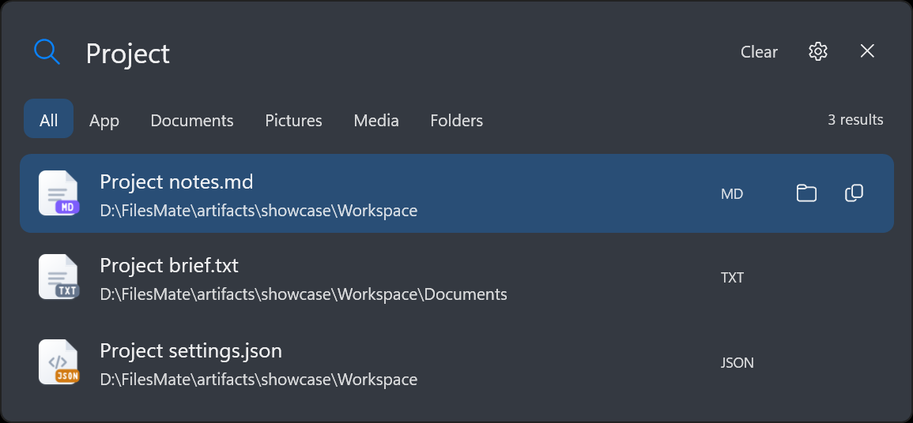
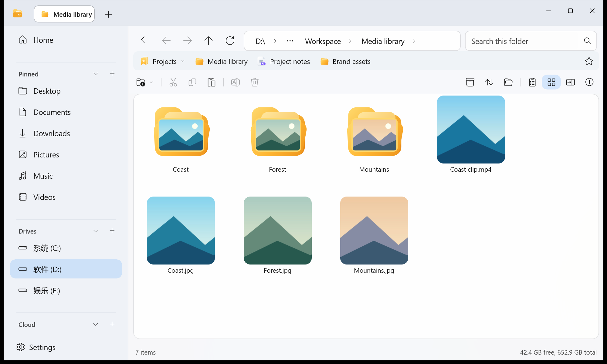
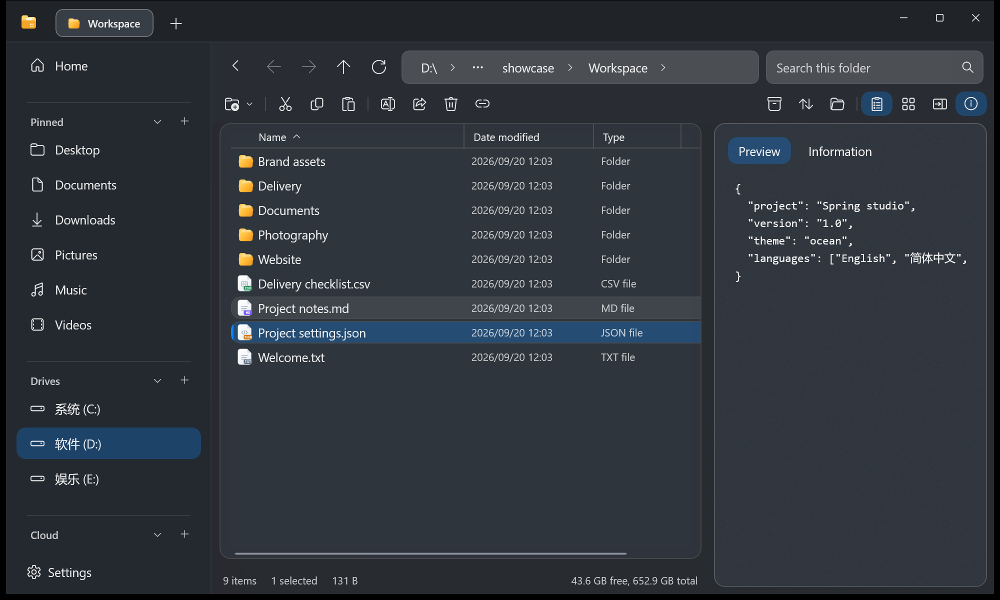
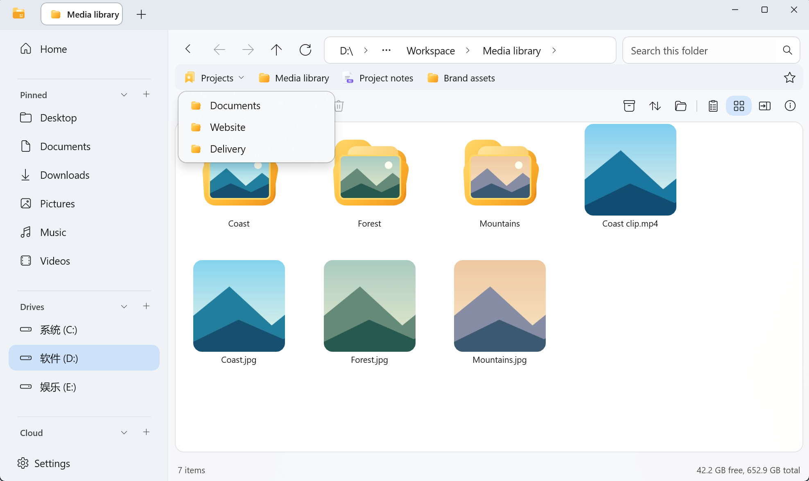
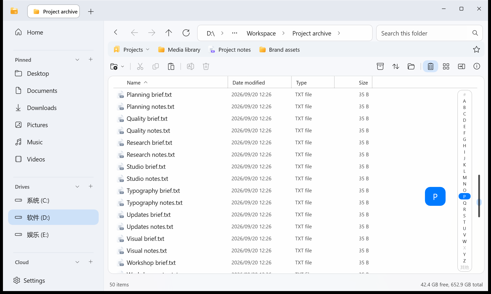
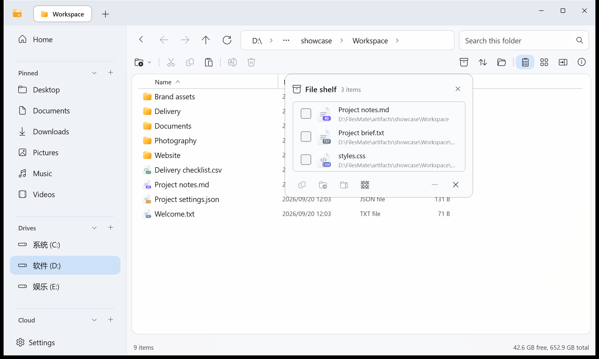
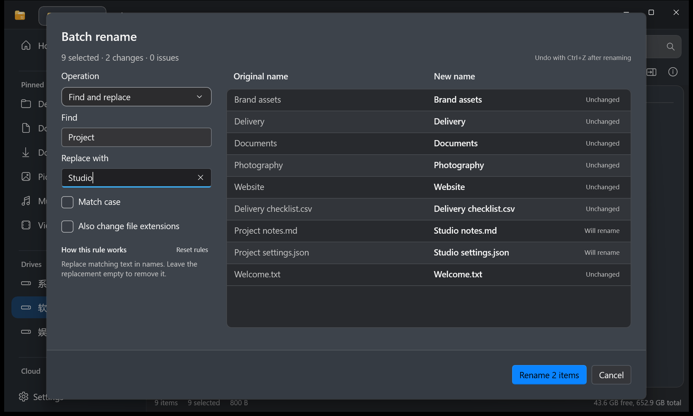
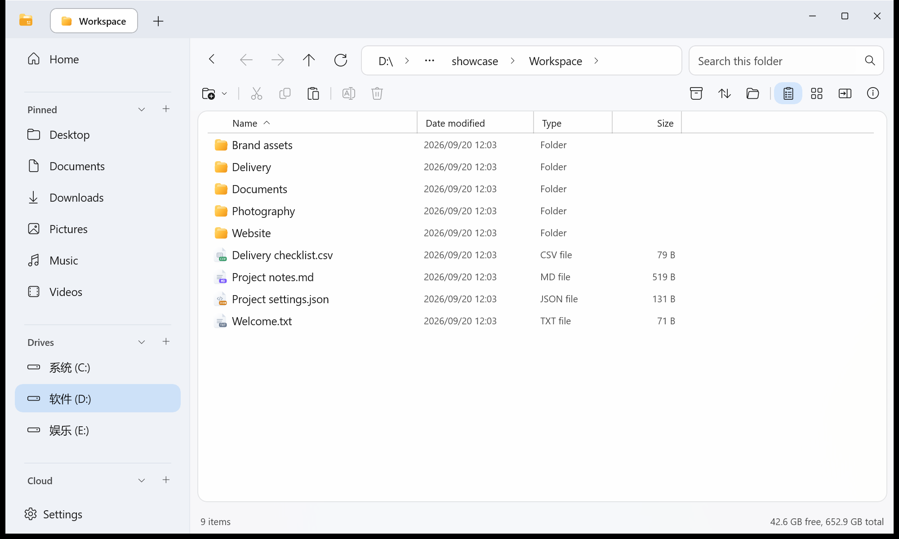

<div align="center">
  
  <h1>FilesMate</h1>
  <p>A Windows file manager with tabs, dual panes, file previews and global search.</p>
  <p><b>English</b> · <a href="README.zh-CN.md">简体中文</a> · <a href="README.ja.md">日本語</a></p>
  <p><a href="https://github.com/DieDust/FilesMate/releases">Download</a> · <a href="#features">Features</a> · <a href="#community">Community</a> · <a href="CONTRIBUTING.md">Contribute</a></p>
  <p>  </p>
</div>



Browse two folders side by side, keep common locations in favorites, and collect files in the shelf before moving them. Preview documents and media as you browse, check names before a batch rename, and use global search after closing the main window.

## Download and get started

1. Download the **win-x64 installer** from [GitHub Releases](https://github.com/DieDust/FilesMate/releases).
2. Install on **Windows 11 22H2 (build 22621) or later, x64**. The installer includes the .NET runtime. This build does not support Windows 10 or ARM64.
3. Choose optional features in the first-run guide. Configure indexing and the background search shortcut in **Settings → Search**.

Already installed? Open **Settings → About → Check for updates**. Updates use the project's HTTPS server with a signed manifest and installer hash verification. This is preview software; see [known limitations](docs/public-release.md).

## Features

### ZIP compression and extraction

Archive commands use **CompactMate** when it is installed. Without it, FilesMate provides built-in ZIP creation and extraction with progress, cancellation, and replace, skip or keep-both choices. Extract into the current folder, a named subfolder, or another location. The file shelf can also create ZIP archives from selected items.

Built-in support covers ordinary ZIP files on local drives. Encrypted archives and other formats require a compatible archive app. See [archive behavior and limits](docs/archive-support.md).

### Tabs and dual panes

Keep folders open in tabs, or turn on **Dual pane** to work with two folders side by side. Copy or move a selection to the other pane, reopen a closed tab with `Ctrl+Shift+T`, and restore your tabs at startup. Idle-tab hibernation is configurable.



### Independent global search

With background search enabled, press **Alt+Space** by default to search indexed filenames and applications. Filter by type, preview supported files, or jump to their folder. The search process can stay open when you close the file manager; its shortcut, residency and login startup are configurable.

Search covers **filenames and applications**. You choose the index scope; the file manager builds and refreshes the index.



### Media thumbnails, folder covers and previews

Switch to **Large icons** to recognize images and supported videos from their thumbnails. Folders can show an automatic cover taken from their contents; choose a cover from an image or video inside the folder through **Folder appearance**, or restore the automatic cover. Thumbnail sizes are adjustable. Video thumbnails depend on Windows format and codec support.



Use **Alt+P** for the side preview, or **Space** for quick preview. Inspect text and code, images, PDF, Markdown and supported Office formats without repeatedly opening another application. Format support and conversion behavior depend on the file and installed Windows components.



### Favorites and groups

Keep frequently used files and folders in the **favorites bar** below the address bar. Drag items into it, save the current folder with the star, and collect related locations into groups. Reorder favorites, rename their labels, or organize them in the favorites manager. These are references: removing a favorite does not delete its file. Enable the bar in the first-run guide or Settings.



### Jump through large folders by first letter

Enable **Alphabet navigation** and sort by name to jump directly to a letter instead of scrolling through a long list. Move over the right-hand navigation area to reveal the letters, then choose one; the letter indicator confirms your position.

The feature is **off by default**, available in the first-run guide and **Settings → Files & folders → Alphabet navigation**. When enabled, it stays hidden below **20 items** and in **dual-pane mode** by default, leaving space for files. Both conditions are configurable.



### File shelf

Gather files from different folders into the **file shelf**, then copy or move the selected items to a destination. The shelf stores references to the originals; collecting them does not create duplicate file copies. Removing a shelf reference does not delete the original.



### Batch rename with a before-and-after view

Select several items and press **F2**. Choose a naming rule, inspect original and proposed names in a compact table, and check reported issues before applying. Extensions are preserved by default. Supported rename operations can be undone with **Ctrl+Z**.



### Appearance and workspace settings

Choose light, dark or system theme; adjust glass transparency, accent color and layered or unified surfaces. Use FilesMate icons or Windows file-association icons. Customize home sections, bookmarks, tags and folder views. **English, Simplified Chinese and Japanese** are included; changing the language automatically restarts the app after transfers finish and restores tabs.



<details>
<summary>More everyday tools</summary>

| Tool | What it does |
| --- | --- |
| Bookmarks and tags | Keep frequently used locations and tagged files within reach. |
| Folder views | Details/icon views, sortable and resizable columns, per-folder or global preferences. |
| Optional letter navigation | Jump by initial in larger folders; off by default, with item-count and dual-pane conditions. |
| Chinese filename sorting | Optional offline pinyin-based ordering for mixed Chinese/English names. |
| Conflict handling | Replace eligible files, skip, or keep both with a numbered name; merge folders and resolve nested conflicts. |
| Delete feedback | Distinguish recycling from permanent deletion. Windows asks before deleting a file that cannot fit in the Recycle Bin. |
| Undo backups | Review and manage retained replacement backups in Settings. Permanent deletion is not undoable. |
| Drag selection | Select across scrolling content, including mouse-wheel scrolling during a drag. |

</details>

## Keyboard essentials

| Shortcut | Action |
| --- | --- |
| `Alt+Space` | Global search, when enabled; configurable |
| `Ctrl+L` | Edit the current path |
| `F2` | Rename or batch rename |
| `Space` / `Alt+P` | Quick preview / side preview |
| `Ctrl+Shift+T` | Reopen a closed tab |
| `Ctrl+Shift+P` | Search commands |
| `Ctrl+Z` | Undo a supported operation |

## Community

**FilesMate QQ group: `984027951`**. Scan in QQ to join, share ideas and discuss everyday usage. The group is primarily Chinese-speaking; English bug reports and contributions are welcome on GitHub.


For reproducible bugs, [open an issue](https://github.com/DieDust/FilesMate/issues) with the app version, Windows version and steps. Report vulnerabilities through [private security reporting](https://github.com/DieDust/FilesMate/security/advisories/new), not public issues or the group.

## Build from source

Use **Windows 11 x64**, **PowerShell 7**, the **.NET 10 SDK** selected by `global.json`, and Windows/WinUI build prerequisites. Packaging additionally needs Inno Setup 6.

```powershell
git clone https://github.com/DieDust/FilesMate.git
cd FilesMate
pwsh ./scripts/build.ps1 -Configuration Release
pwsh ./scripts/test.ps1 -Configuration Release
# Optional: create a self-contained installer
pwsh ./scripts/package.ps1
```

Build in a separate checkout if your installation uses a development output directory. No update-signing private key is needed to build or package. Forks distributing updates must use their own feed and signing identity; see [updates](docs/updates.md).

[Contributing](CONTRIBUTING.md) · [Architecture](docs/architecture.md) · [Localization](docs/localization.md) · [Security](SECURITY.md) · [Release checks and limitations](docs/public-release.md)

## License and credits

[Apache License 2.0](LICENSE). Adapted Files Community UI code and bundled dependencies retain their respective licenses. See [NOTICE](NOTICE), [third-party notices](THIRD-PARTY-NOTICES.md) and [asset provenance](docs/assets.md). FilesMate is independent, not an official release of Files Community or Microsoft.

Screenshots show the actual app using demonstration files. Community artwork was supplied by the maintainer.
