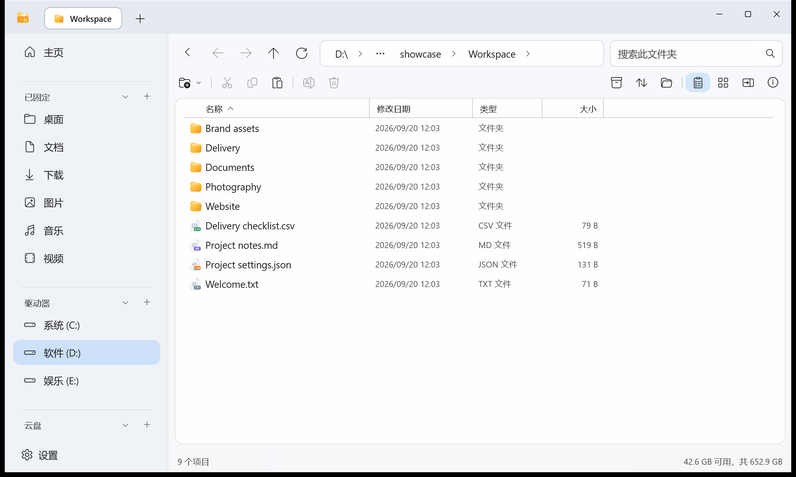

<div align="center">
  
  <h1>FilesMate</h1>
  <p>Windows 文件管理器，支持多标签、双栏浏览、文件预览和全局搜索。</p>
  <p><a href="README.md">English</a> · <b>简体中文</b> · <a href="README.ja.md">日本語</a></p>
  <p><a href="https://github.com/DieDust/FilesMate/releases">下载安装</a> · <a href="#功能亮点">功能亮点</a> · <a href="#交流与反馈">交流与反馈</a> · <a href="CONTRIBUTING.md">参与贡献</a></p>
  <p>  </p>
</div>



用双栏并排处理两个目录，把常用位置放进收藏夹，把不同目录的文件先收进暂存架。浏览时可以直接预览文档和媒体，批量改名前可以对照结果，关闭主窗口后也能继续使用全局搜索。

## 下载与开始使用

1. 前往 [GitHub Releases](https://github.com/DieDust/FilesMate/releases)，下载 **win-x64 安装包**。
2. 支持 **Windows 11 22H2（系统版本 22621）及以上，x64**。安装包自带 .NET 运行时，无须单独安装 SDK。此版本不支持 Windows 10 和 ARM64。
3. 在首次启动引导中选择需要的功能；通过 **设置 → 搜索** 配置索引范围和后台搜索快捷键。

已经安装的用户可以通过 **设置 → 关于 → 检查更新** 在线升级。在线更新使用项目的 HTTPS 服务器，校验更新清单签名和安装包哈希。软件仍处于预览阶段，已知限制见[发布检查说明](docs/public-release.md)。

## 功能亮点

### ZIP 压缩与解压

已安装 **CompactMate** 时，压缩和解压会优先使用它；未安装时，可直接使用内置 ZIP 功能，查看进度、取消操作，并在同名冲突时选择替换、跳过或保留两者。可以解压到当前位置、同名子文件夹或其他位置，也可以从文件暂存架选择项目创建 ZIP。

内置功能支持本地磁盘上的普通 ZIP。加密压缩包及其他格式需要兼容的压缩软件，具体范围见[压缩功能说明](docs/archive-support.md)。

### 多标签与双栏浏览

用标签页同时打开多个目录，或开启 **双栏模式**，把两个文件夹并排放好。选中的文件可以复制或移动到另一栏；`Ctrl+Shift+T` 可重新打开刚关闭的标签，启动时也可以恢复上次的标签页。闲置标签页的休眠策略可以自行调整。


### 独立运行的全局搜索

开启后台搜索后，默认按 **Alt+Space** 即可搜索已索引的文件名和应用。可以按类型筛选、预览支持的文件，或直接跳转到文件所在位置。搜索进程独立于主窗口，常驻、开机启动和快捷键均可配置。

搜索范围包括**文件名和应用**。索引目录由你选择，索引的建立和更新由文件管理器负责。


### 图片、视频缩略图与文件夹封面

切换到 **大图标视图**，直接通过缩略图辨认图片和支持的视频。文件夹也能从内部内容自动生成封面，通过 **文件夹外观** 选择文件夹内的图片或视频作为封面，或恢复自动封面。缩略图大小可以调整；视频缩略图的支持情况取决于 Windows 的格式与解码能力。


按 **Alt+P** 展开侧边预览，或按 **空格** 打开快速预览。文字与代码、图片、PDF、Markdown 和支持的 Office 文件都能在浏览文件时查看，减少反复启动其他软件。具体格式的预览和转换能力取决于文件类型及已安装的 Windows 组件。


### 收藏夹与分组

地址栏下方的 **收藏栏** 可以收藏常用文件和文件夹：拖入项目，或点击星标收藏当前目录，还能将相关位置整理进分组。支持调整顺序、修改收藏名称，并通过收藏管理器统一整理。收藏保存的是引用，移除收藏不会删除原文件。可在首次引导或设置中开启收藏栏。


### 字母快速定位

开启 **字母定位** 并按名称排序后，可以直接跳到对应首字母的文件位置。鼠标移到列表右侧导航区域，展开字母表并选择字母，旁边的大字母提示会标明当前定位位置。

这项功能 **默认关闭**，可在首次启动引导，或 **设置 → 文件与文件夹 → 字母定位** 中手动开启。启用后默认在项目数 **少于 20 个** 时隐藏，**双栏模式** 下也默认隐藏，给文件内容保留阅读空间；这两个条件都可以自行调整。


### 文件暂存架

把不同文件夹里的文件收进 **文件暂存架**，再统一选择目标位置进行复制或移动。暂存架保存的是原文件的引用，收集时不会另外复制一份大文件；从暂存架移除引用，也不会删除原文件。


### 批量重命名与结果预览

多选文件后按 **F2**，选择命名规则，在紧凑的表格中对照原名称和新名称，检查提示的问题后再应用。默认保留文件扩展名，支持撤销的重命名操作可按 **Ctrl+Z** 撤回。


### 外观与工作区设置

支持浅色、深色和跟随系统主题，可调节玻璃透明度、强调色，以及分层或统一的界面风格。文件图标可以使用 FilesMate 自带样式，也可以切换成 Windows 的默认关联图标。主页区域、收藏、标签和文件夹视图都可以调整。软件内置**简体中文、英语、日语**；切换语言后会等待文件传输结束，自动重启并恢复标签页。


<details>
<summary>更多日常功能</summary>

| 功能 | 用途 |
| --- | --- |
| 收藏与标签 | 快速回到常用位置，按标签整理文件。 |
| 文件夹视图 | 详情和图标模式，自定义列的显示、顺序与宽度，支持按文件夹或全局保存。 |
| 可选字母导航 | 按首字母定位；默认关闭，可设置最少项目数与双栏显示条件。 |
| 中文文件名排序 | 可选离线拼音排序，方便处理中英文混合名称。 |
| 同名冲突处理 | 对符合条件的文件提供替换、跳过、保留两者并编号；合并文件夹时继续处理内部冲突。 |
| 删除结果提示 | 区分回收和永久删除；文件过大无法放入回收站时，由 Windows 询问是否永久删除。 |
| 撤销备份管理 | 在设置里查看和管理保留的替换备份；永久删除不能撤销。 |
| 滚动框选 | 可以跨滚动区域连续选择，按住左键框选时也能使用滚轮。 |

</details>

## 常用快捷键

| 快捷键 | 操作 |
| --- | --- |
| `Alt+Space` | 全局搜索，需要先开启，可自定义 |
| `Ctrl+L` | 编辑地址栏 |
| `F2` | 重命名，多选时为批量重命名 |
| `空格` / `Alt+P` | 快速预览 / 侧边预览 |
| `Ctrl+Shift+T` | 重新打开已关闭的标签页 |
| `Ctrl+Shift+P` | 搜索命令 |
| `Ctrl+Z` | 撤销支持撤回的操作 |

## 交流与反馈

**FilesMate QQ 交流群：`984027951`**。欢迎交流使用体验、提出建议，也欢迎分享你的工作区。


可复现的问题建议提交到 [GitHub Issues](https://github.com/DieDust/FilesMate/issues)，附上软件版本、Windows 版本和复现步骤。安全漏洞请通过[私密安全报告](https://github.com/DieDust/FilesMate/security/advisories/new)提交，不要在公开 Issue 或群聊中发送利用细节和敏感文件。

## 从源码构建

需要 **Windows 11 x64、PowerShell 7、`global.json` 指定的 .NET 10 SDK**，以及 Windows / WinUI 构建环境。制作安装包另外需要 Inno Setup 6。

```powershell
git clone https://github.com/DieDust/FilesMate.git
cd FilesMate
pwsh ./scripts/build.ps1 -Configuration Release
pwsh ./scripts/test.ps1 -Configuration Release
# 可选：生成自带运行时的安装包
pwsh ./scripts/package.ps1
```

如果当前安装位置正好是开发输出目录，请另建源码目录后再构建，避免覆盖正在运行的程序。构建和打包不需要官方更新签名私钥；自行分发更新的分支应使用自己的更新源和密钥，详见[在线更新说明](docs/updates.md)。

[贡献指南](CONTRIBUTING.md) · [架构说明](docs/architecture.md) · [翻译指南](docs/localization.md) · [安全说明](SECURITY.md) · [发布检查与已知限制](docs/public-release.md)

## 许可证与致谢

使用 [Apache License 2.0](LICENSE) 开源。改编自 Files Community 的界面代码及第三方依赖保留各自的许可证，详见 [NOTICE](NOTICE)、[第三方声明](THIRD-PARTY-NOTICES.md)和[素材来源](docs/assets.md)。FilesMate 是独立项目，并非 Files Community 或 Microsoft 的官方版本。

展示图来自软件真实界面，使用的是演示文件；交流群图片由维护者提供。
